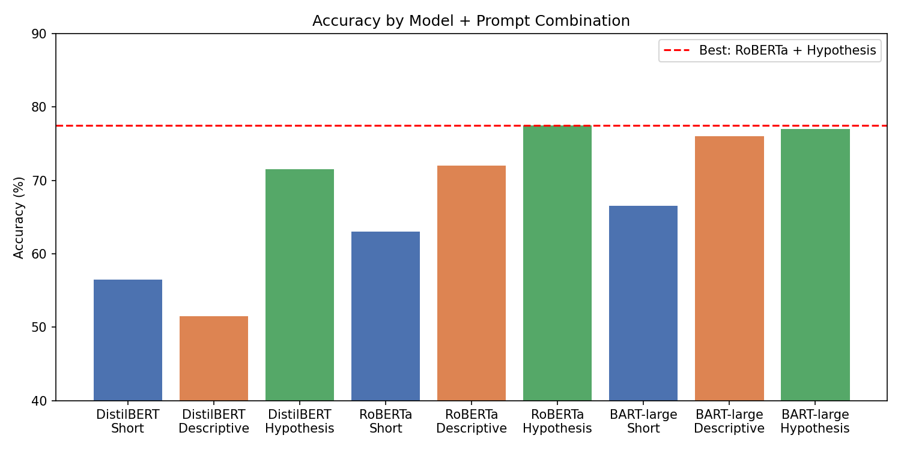
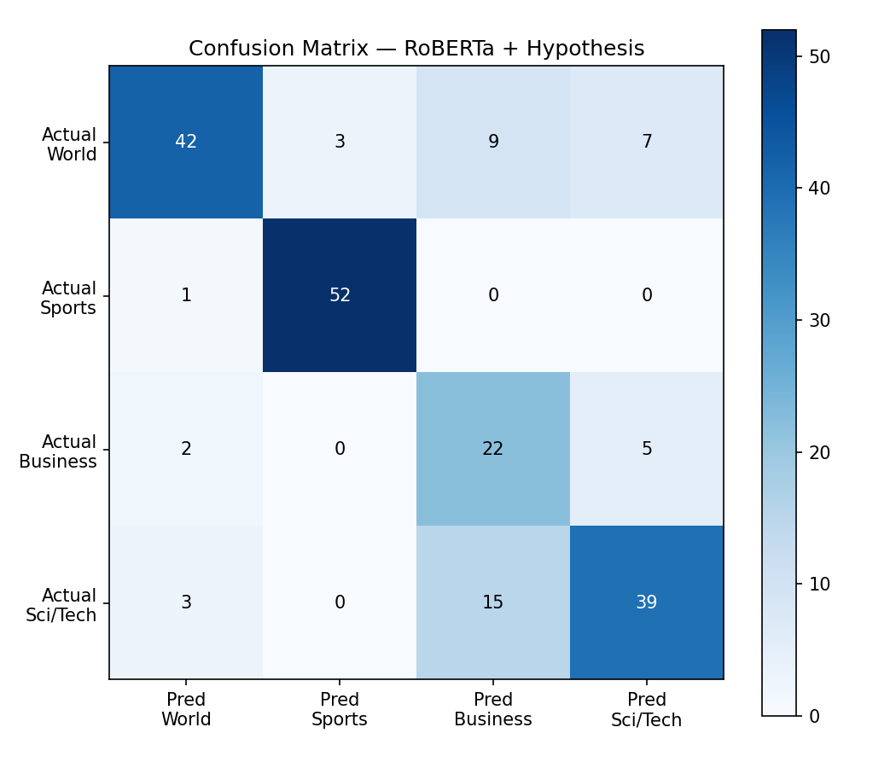
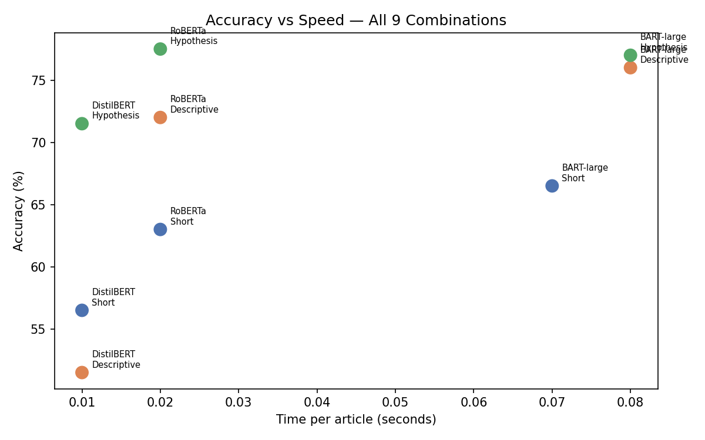

# nlp-zeroshot-benchmark

A systematic comparison of three transformer models across three prompt strategies for zero-shot news article classification using Hugging Face Pipelines.

---

## What This Project Does

Classifies news articles into four categories — **World News, Sports, Business, Science & Technology** — without any task-specific training data. Instead of fine-tuning, it uses zero-shot classification via Natural Language Inference (NLI), testing how well different models and prompt styles perform out of the box.

**Dataset:** AG News (300 test articles)  
**Models tested:** 3  
**Prompt strategies tested:** 3  
**Total experiments:** 9  

---

## Key Result

| Model | Prompt | Accuracy | F1 | Speed |
|---|---|---|---|---|
| DistilBERT | Short | 56.50% | 0.555 | 0.01s/article |
| DistilBERT | Descriptive | 51.50% | 0.471 | 0.01s/article |
| DistilBERT | Hypothesis | 71.50% | 0.723 | 0.01s/article |
| RoBERTa | Short | 63.00% | 0.588 | 0.02s/article |
| RoBERTa | Descriptive | 72.00% | 0.701 | 0.02s/article |
| **RoBERTa** | **Hypothesis** | **77.50%** | **0.781** | **0.02s/article** |
| BART-large | Short | 66.50% | 0.631 | 0.07s/article |
| BART-large | Descriptive | 76.00% | 0.744 | 0.08s/article |
| BART-large | Hypothesis | 77.00% | 0.784 | 0.08s/article |

**Winner: RoBERTa + Hypothesis** — matches BART-large accuracy at 4× the speed.

---

## Charts

### Accuracy by Model + Prompt


### Confusion Matrix — Best Model (RoBERTa + Hypothesis)


### Accuracy vs Speed — All 9 Combinations


---

## Models

| Model | Parameters | Expected Accuracy | Speed (GPU) |
|---|---|---|---|
| `facebook/bart-large-mnli` | 400M | ~77% | ~0.3s/article |
| `cross-encoder/nli-roberta-base` | 125M | ~77% | ~0.15s/article |
| `typeform/distilbert-base-uncased-mnli` | 66M | ~71% | ~0.06s/article |

---

## Prompt Strategies

**Short** — minimal single-word labels
```
'World', 'Sports', 'Business', 'Science and Technology'
```

**Descriptive** — rich keyword phrases
```
'World news, politics, and global events'
'Sports, athletics, teams, and competitions'
'Business, economy, finance, and markets'
'Science, technology, AI, and innovation'
```

**Hypothesis** — full NLI-style sentences (best performer)
```
'This article is about world news or politics'
'This article is about sports or athletics'
'This article is about business or economy'
'This article is about science or technology'
```

---

## How to Run

### Option 1 — Google Colab (Recommended)

1. Open [colab.research.google.com](https://colab.research.google.com)
2. Runtime → Change runtime type → **T4 GPU**
3. Run the cells below in order

### Option 2 — Local (requires CUDA GPU)

```bash
pip install transformers datasets scikit-learn pandas torch
python run_experiments.py
```

---

## Colab Cells

**Cell 1 — Verify GPU**
```python
import torch
print(torch.cuda.is_available())
print(torch.cuda.get_device_name(0))
```

**Cell 2 — Install**
```python
!pip install transformers datasets scikit-learn pandas -q
```

**Cell 3 — Load data**
```python
from datasets import load_dataset
dataset     = load_dataset('ag_news', split='test[:200]')
articles    = list(dataset['text'])
true_labels = list(dataset['label'])
CATEGORIES  = ['World News', 'Sports', 'Business', 'Science and Technology']
```

**Cell 4 — Load models**
```python
import torch
from transformers import pipeline

device     = 0 if torch.cuda.is_available() else -1
batch_size = 16 if torch.cuda.is_available() else 1

model_distilbert = pipeline('zero-shot-classification',
                             model='typeform/distilbert-base-uncased-mnli', device=device)
model_roberta    = pipeline('zero-shot-classification',
                             model='cross-encoder/nli-roberta-base', device=device)
model_bart       = pipeline('zero-shot-classification',
                             model='facebook/bart-large-mnli', device=device)

models = {
    'DistilBERT' : model_distilbert,
    'RoBERTa'    : model_roberta,
    'BART-large' : model_bart,
}
```

**Cell 5 — Run all 9 experiments**
```python
import time, pandas as pd
from sklearn.metrics import accuracy_score, f1_score

prompts = {
    'Short'      : ['World', 'Sports', 'Business', 'Science and Technology'],
    'Descriptive': ['World news, politics, and global events',
                    'Sports, athletics, teams, and competitions',
                    'Business, economy, finance, and markets',
                    'Science, technology, AI, and innovation'],
    'Hypothesis' : ['This article is about world news or politics',
                    'This article is about sports or athletics',
                    'This article is about business or economy',
                    'This article is about science or technology'],
}

results = []
for model_name, clf in models.items():
    for prompt_name, label_names in prompts.items():
        print(f"Running {model_name} + {prompt_name}...")
        start   = time.time()
        outputs = clf(articles, candidate_labels=label_names,
                      batch_size=batch_size, truncation=True, max_length=512)
        elapsed = time.time() - start
        preds   = [label_names.index(o['labels'][0]) for o in outputs]
        scores  = [o['scores'][0] for o in outputs]
        acc     = accuracy_score(true_labels, preds)
        f1      = f1_score(true_labels, preds, average='weighted')
        c = [s for s,p,t in zip(scores,preds,true_labels) if p==t]
        w = [s for s,p,t in zip(scores,preds,true_labels) if p!=t]
        gap = (sum(c)/len(c)) - (sum(w)/len(w))
        results.append({'Model': model_name, 'Prompt': prompt_name,
                        'Accuracy': f'{acc:.2%}', 'F1': f'{f1:.3f}',
                        'Conf Gap': f'{gap:.2f}', 'Sec/Article': f'{elapsed/200:.2f}s'})
        print(f"Accuracy: {acc:.2%} | F1: {f1:.3f} | Gap: {gap:.2f}")

df = pd.DataFrame(results)
print(df.to_string(index=False))
df.to_csv('results.csv', index=False)
```

---

## Key Findings

**1. Prompt matters more than model size**
DistilBERT + Hypothesis (71.5%) beats BART-large + Short (66.5%). A 66M parameter model with a better prompt outperforms a 400M parameter model with a weak one.

**2. Hypothesis prompts win consistently**
Across all three models, the Hypothesis strategy (full NLI-style sentences) outperforms both Short and Descriptive labels. This aligns with how NLI models are trained internally.

**3. Descriptive labels hurt small models**
DistilBERT + Descriptive scored only 51.5% — near random guessing. Small models cannot effectively leverage rich keyword lists.

**4. RoBERTa is the production choice**
Matches BART-large accuracy at 4× the speed. Clear winner for any real-world deployment.

**5. Confidence gap reveals reliability**
DistilBERT's confidence gap of 0.04–0.08 means it is nearly equally confident whether right or wrong — making it unsuitable for production use despite its speed.

---

## Error Analysis

The dominant failure pattern is **Sci/Tech articles misclassified as Business** — 15 out of 18 total Sci/Tech errors in the best model. Articles about IBM, Google, and Apple contain strong business signals (hiring, IPO, retail) that override the technology context. This is a label boundary issue in the AG News dataset itself.

---

## Files

```
nlp-zeroshot-benchmark/
├── README.md
├── results.csv              # All 9 experiment results
├── accuracy_chart.png       # Bar chart — accuracy by combination
├── confusion_matrix.png     # Heatmap — RoBERTa + Hypothesis
└── speed_vs_accuracy.png    # Scatter — accuracy vs inference speed
```

---

## Tech Stack

- [Hugging Face Transformers](https://huggingface.co/docs/transformers)
- [Hugging Face Datasets](https://huggingface.co/docs/datasets)
- [scikit-learn](https://scikit-learn.org/)
- [pandas](https://pandas.pydata.org/)
- [matplotlib](https://matplotlib.org/)
- Python 3.10+ / Google Colab T4 GPU

---

## References

- AG News dataset — Zhang et al., 2015
- BART — Lewis et al., 2019 — [arxiv](https://arxiv.org/abs/1910.13461)
- RoBERTa — Liu et al., 2019 — [arxiv](https://arxiv.org/abs/1907.11692)
- DistilBERT — Sanh et al., 2019 — [arxiv](https://arxiv.org/abs/1910.01108)
- Yin et al., 2019 — Benchmarking Zero-shot Text Classification — [arxiv](https://arxiv.org/abs/1909.00161)
